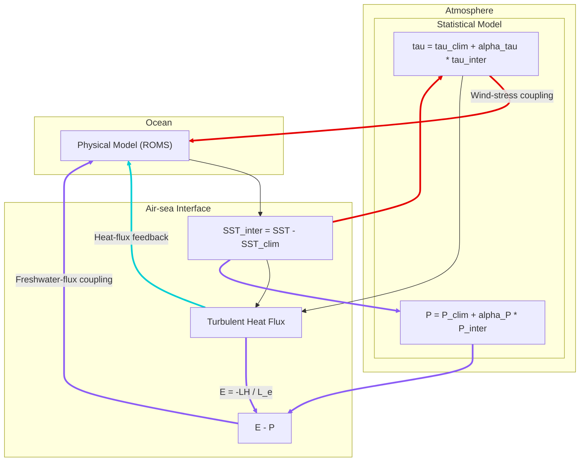

# ROMS-Based Hybrid Coupled Model (HCM)

This project is a ROMS-based Hybrid Coupled Model (HCM) developed from **COAWST v1467**. ROMS serves as the dynamical ocean component, while a Singular Value Decomposition (SVD)-based statistical atmospheric model represents the response of surface wind stress and precipitation to sea surface temperature (SST) anomalies. Turbulent heat fluxes and freshwater fluxes close the air-sea feedback loop.

The core model is described in:

> Yu, Y. et al. (2025): *A flexible Regional Ocean Modeling System-based hybrid coupled model for El Niño-Southern Oscillation studies*. Geoscientific Model Development, 18, 5527-5547. https://doi.org/10.5194/gmd-18-5527-2025

The current code extends the published model with optimized MPI communication for high-resolution applications. It also includes optional precipitation coupling, ocean biogeochemistry, tropical instability wave (TIW) feedback, SST filtering, and AI-based coupling components.

## 1. Model Architecture

The updated HCM consists of three coupled layers:

1. **Atmosphere**: a statistical model reconstructs wind stress and precipitation from the interannual SST anomaly;
2. **Air-sea interface**: the SST anomaly drives the statistical model, while wind stress and SST determine the turbulent heat flux. Evaporation diagnosed from latent heat flux is combined with precipitation to form `E-P`;
3. **Ocean**: ROMS supplies SST to the coupling system and receives wind-stress, heat-flux, and freshwater-flux feedbacks.



### 1.1 Wind-Stress Feedback

The total surface wind stress is

$$
\boldsymbol{\tau}=\boldsymbol{\tau}_{\mathrm{clim}}
 +\alpha_{\tau}\boldsymbol{\tau}_{\mathrm{inter}},
$$

where `alpha_tau` controls the strength of the interannual wind-stress feedback.

### 1.2 Precipitation and Freshwater-Flux Feedback

The updated statistical model predicts precipitation rather than the complete net freshwater flux:

$$
P=P_{\mathrm{clim}}+\alpha_P P_{\mathrm{inter}}.
$$

Evaporation is diagnosed from the latent heat flux:

$$
E=-\frac{LH}{L_e}.
$$

The net freshwater flux applied to the ROMS surface salinity boundary condition is

$$
E-P.
$$

Some historical `FWF` names are retained for backward compatibility. For example, `HCM_ALPHA_FWF` represents the precipitation coupling coefficient `alpha_P` in the current implementation, while `dWdT_*` stores the projection weights and spatial modes for the SST-to-precipitation response.

### 1.3 Turbulent Heat-Flux Feedback

The air-sea interface uses bulk formulas to calculate latent and sensible heat fluxes:

$$
LH=-\rho_a L_e C_E V_{wg}(q_s-q_a),
$$

$$
SH=-\rho_a c_p C_H V_{wg}(SST-T_a).
$$

Surface wind speed is inferred from the wind stress. The current implementation uses `Cd=1.7e-3`, `Ce=1.4e-3`, and `Ch=1.4e-3`.

## 2. SVD-Based Statistical Atmospheric Model

The statistical relationship is constructed by applying SVD to the covariance matrix between SST anomalies and atmospheric response fields. The default model retains the first five SVD modes.

For each mode `k`, every ROMS partition first computes a local projection coefficient:

$$
a_k^{(r)}=\sum_{(i,j)\in r} SST_{\mathrm{inter}}(i,j)W_k(i,j),
$$

where `r` denotes an MPI partition and `W_k` is the SST projection weight. The global modal coefficient is

$$
a_k=\sum_r a_k^{(r)}.
$$

After receiving the global coefficients, each partition reconstructs its local atmospheric forcing:

$$
Y_{\mathrm{inter}}(i,j)=\alpha_Y\sum_{k=1}^{K}a_kM_k(i,j),
$$

where `M_k` is a wind-stress or precipitation response mode and the default mode count is `K=5`.

The primary SVD input variables are:

- `dUdT_W1...W5` and `dVdT_W1...W5`: projection weights from SST to wind-stress modes;
- `dUdT_M1...M5` and `dVdT_M1...M5`: wind-stress response modes;
- `dWdT_W1...W5`: projection weights from SST to precipitation modes;
- `dWdT_M1...M5`: precipitation response modes.

## 3. High-Resolution MPI Optimization

The original coupling architecture can gather the complete SST field on a root process, run the statistical model, and distribute complete forcing fields back to the ROMS partitions. Its communication volume increases with the number of grid points and can become a bottleneck in high-resolution simulations.

The optimized default SVD pathway exploits the low-rank modal representation:

```text
Each MPI rank
    └─ Computes local SVD projection coefficients on its ROMS tile
             ↓
Root rank
    └─ Sums a small set of modal coefficients
             ↓
All MPI ranks
    └─ Receive the global coefficients and reconstruct forcing locally
```

With five retained modes, each rank exchanges only:

- 5 zonal wind-stress coefficients;
- 5 meridional wind-stress coefficients;
- 5 precipitation coefficients.

The communication scale is therefore reduced from approximately

$$
O(N_{\mathrm{grid}})
$$

to

$$
O(KN_{\mathrm{rank}}),
$$

where `K` is the number of retained modes. As the grid resolution increases, the communicated data volume does not grow directly with the number of local grid points. This design enables high-resolution and large-scale MPI simulations.

The `HCM_AI_COUPLING`, `HCM_AI_WIND`, and `HCM_AI_FWF` pathways require complete two-dimensional fields. Global SST filtering may also require full-field communication. The optimized coefficient-only pathway applies to the default non-AI SVD configuration without global SST filtering.

## 4. Repository Structure

| Path | Description |
|---|---|
| `ROMS/Nonlinear/hcm_forcing.F` | Main HCM coupling, local SVD projection, MPI coefficient reduction, and local forcing reconstruction |
| `ROMS/Nonlinear/hcm_filter.F` | Optional spatial filtering of SST |
| `ROMS/Nonlinear/set_vbc.F` | Bulk heat fluxes, evaporation, and the `E-P` surface boundary condition |
| `ROMS/Nonlinear/main3d.F` | HCM call sites within the ROMS time integration |
| `ROMS/Modules/mod_forces.F` | HCM forcing fields, SVD weights, and modal data structures |
| `ROMS/Modules/mod_scalars.F` | Coupling intervals, feedback coefficients, and initial-perturbation parameters |
| `ROMS/Utility/read_phypar.F` | HCM parameter parsing from `ocean.in` |
| `ROMS/External/varinfo.dat` | HCM NetCDF variable names, units, and scale factors |
| `Project/HCM/EXP_Run` | Experiment configurations, initial conditions, boundary conditions, and forcing data |
| `Project/HCM/Matlab` | Preprocessing, postprocessing, and ENSO diagnostic tools |

## 5. Experiment Configurations

`Project/HCM/EXP_Run` provides a 2 x 2 experiment matrix spanning physical versus biogeochemical simulations and climatological versus interactive HCM forcing:

| Experiment | ROMS | HCM Feedback | UMAINE Biogeochemistry |
|---|---:|---:|---:|
| `OCM_CLM` | Yes | No; climatological integration | No |
| `OCM_HCM` | Yes | Yes | No |
| `BIO_CLM` | Yes | No; climatological integration | Yes |
| `BIO_HCM` | Yes | Yes | Yes |

Primary parameters in the example configuration include:

- Horizontal grid: `Lm=389`, `Mm=119`;
- Vertical levels: `N=50`;
- ROMS time step: 600 s;
- HCM coupling interval: 86400 s;
- Default wind-stress coupling coefficient: `HCM_ALPHA_TAU=1.5`;
- Default precipitation coupling coefficient: `HCM_ALPHA_FWF=1.0`;
- Initial perturbation duration: 240 d.

The Part 1 ENSO wind-stress sensitivity experiments in the GMD paper use `alpha_FWF=0` and test `alpha_tau=1.0, 1.3, 1.5, 1.7, 2.0`. The current `OCM_HCM` and `BIO_HCM` examples enable precipitation feedback and are more representative of the subsequent freshwater-flux extension.

## 6. Build Requirements

The model targets Linux and HPC environments. Typical dependencies include:

- GNU Make;
- A Fortran compiler; the current scripts default to Intel Fortran;
- MPI;
- NetCDF-C and NetCDF-Fortran;
- Other optional libraries required by the selected COAWST/ROMS configuration.

Each experiment directory contains a `coawst.bash` script defining compiler, MPI, NetCDF, source, and project paths. At minimum, review the following settings before building:

```bash
COAWST_APPLICATION=HCM
MY_ROOT_DIR=/path/to/Code
MY_PROJECT_DIR=/path/to/experiment
FORT=ifort                 # Adjust for the target environment
USE_MPI=on
USE_MPIF90=on
```

## 7. Building and Running

The following example builds the physical HCM experiment:

```bash
cd Project/HCM/EXP_Run/OCM_HCM

# First update the source, compiler, MPI, and NetCDF paths in coawst.bash.
chmod +x coawst.bash
./coawst.bash -j 8
```

An MPI build generates `coawstM` by default. Before running, verify the `Data`, `Build`, and `Result` paths and check all input and output paths in `ocean.in`:

```bash
mpirun -np <NPROC> ./coawstM ocean.in > hcm.log 2>&1
```

The MPI process count must be compatible with the ROMS tile decomposition and the allocated computing resources.

## 8. Primary Compile-Time Options

| Macro | Purpose |
|---|---|
| `HCM_COUPLING` | Enables the HCM |
| `HCM_CLIM_SPIN` | Runs a climatological spin-up without interannual HCM feedback |
| `HCM_WIND_STRESS` | Enables statistical SST-to-wind-stress coupling |
| `HCM_EMINP_FORCE` | Enables statistical SST-to-precipitation coupling; the name is retained for historical compatibility |
| `HCM_BULK_FLUX` | Enables the HCM bulk heat-flux module |
| `HCM_BULK_EVAP` | Diagnoses evaporation from latent heat flux |
| `HCM_INITIAL_KICK` | Enables the initial ENSO-like perturbation |
| `HCM_SST_FILTER` | Enables spatial SST filtering |
| `TIW_COUPLING` | Enables the tropical instability wave feedback extension |
| `HCM_AI_COUPLING` | Enables the external AI coupling framework |

## 9. Output and Diagnostics

The HCM can output the following key diagnostic variables:

- `SSTC`: climatological SST;
- `SSTA`: SST anomaly;
- `SSTF`, `SSTH`, and `SSTL`: SST filtering diagnostics;
- `sustrC` and `svstrC`: climatological wind stress;
- `sustrA` and `svstrA`: wind-stress anomalies;
- `rainC` and `rainA`: climatological precipitation and precipitation anomaly;
- Surface latent heat, sensible heat, evaporation, and `E-P`;
- ROMS temperature-budget and three-dimensional ENSO diagnostics.

MATLAB tools are available under `Project/HCM/Matlab`. They include Niño index calculations, Hovmöller diagrams, vertical-coordinate conversion, mean-field processing, and heat-budget analysis.

## 10. Development Notes

- The default high-resolution SVD pathway communicates modal coefficients rather than complete two-dimensional forcing fields.
- Some variables retain early FWF terminology, although the updated implementation represents statistical precipitation combined with bulk-diagnosed evaporation.
- The AI and TIW pathways are extensions beyond the core published model and should be validated independently for MPI message matching, external-process synchronization, and failure handling.
- Before conducting long integrations, perform conservation checks, MPI decomposition consistency tests, and reproducibility tests using different process counts.

## 11. License and Citation

This repository contains COAWST, ROMS, and other third-party components. Use and redistribution must comply with the licenses of the corresponding upstream projects.

When using this HCM in research, cite the GMD paper listed above, together with the appropriate COAWST, ROMS, and input-dataset references for the selected configuration.
